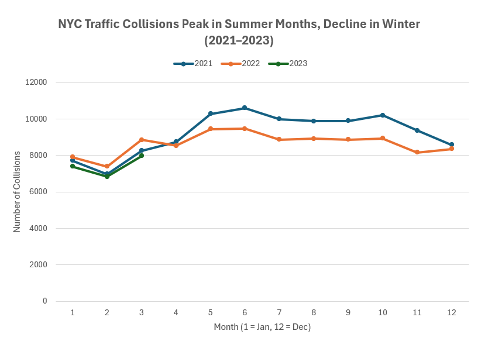
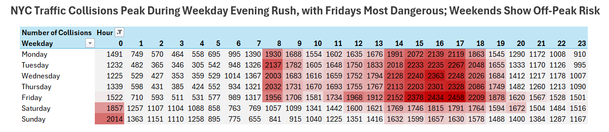
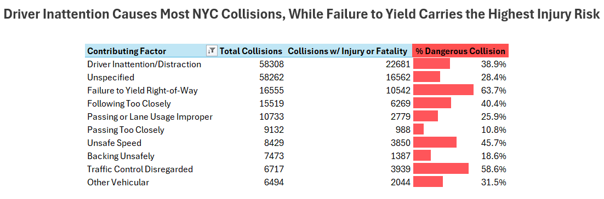

# 📊 NYC Traffic Collisions Analysis (2021–2023) 🚦

## 📌 Overview
This project delivers a **comprehensive analysis of New York City traffic collisions from 2021 to 2023** using Microsoft Excel.  
The aim: uncover patterns in collision volume, temporal trends, high-risk periods, and contributing factors to inform **smarter traffic-safety decisions**.  

By combining pivot tables, heatmaps, and calculated metrics, this project transforms raw collision data into actionable insights that can guide urban planners, policymakers, and public safety initiatives.  

---

## 🎯 Key Insights & Findings

### 📅 Seasonal Collision Trends
**Observation:** Collisions peak in late spring and early summer (May–June), then decline into winter months.  
**Interpretation:** Higher spring/summer collisions may correspond to increased traffic volumes, warmer weather, and longer daylight hours. Seasonal tourism and construction activity could also contribute to the uptick in incidents.  
**Visual:**  
  
*Seasonal trends highlight critical periods for traffic-safety campaigns.*

---

### 🚗 Weekday Rush-Hour Risks
**Observation:** Collisions cluster heavily between **3–6 PM on weekdays**, with **Fridays** showing the highest concentration.  
**Interpretation:** Afternoon/evening commuter traffic, combined with driver fatigue and congestion, creates high-risk windows. Friday spikes may indicate end-of-week stress, aggressive driving, or heavier urban traffic patterns.  
**Visual:**  
  
*Rush-hour hotspots pinpoint priority areas for targeted interventions.*

---

### ⚠️ Late-Night Weekend Vulnerability
**Observation:** A notable increase in collisions occurs around **midnight on weekends**, diverging from typical weekday patterns.  
**Interpretation:** Likely influenced by nightlife, alcohol consumption, and reduced visibility. Strategic enforcement and public-awareness campaigns could mitigate risks during these periods.  
**Visual:**  
  
*Identifies periods where enhanced vigilance and preventive measures are critical.*

---

### ❗ Contributing Factors & High-Risk Behaviors
**Observation:**  
- **Driver Inattention/Distraction** accounts for the largest share of total collisions.  
- **Failure to Yield Right-of-Way** results in the highest percentage of injury/fatal collisions.  

**Interpretation:** These insights emphasize the importance of **behavioral interventions**, targeted traffic enforcement, and public safety education to reduce high-severity incidents.  

**Visual:**  
  
*Highlights top contributors to collisions and relative severity.*

---

## 🛠️ Skills Demonstrated
- Advanced **pivot tables** for multidimensional analysis  
- **Conditional formatting** & heatmaps to visualize complex patterns  
- **Trend line visualizations** and custom calculated fields (% of dangerous collisions)  
- Data cleaning, preprocessing, and quality checks  
- Insight storytelling for non-technical stakeholders  
- Git & GitHub version control with LFS  

---

## 📂 Tools & Dataset
- **Tools Used:** Microsoft Excel, Git & GitHub, Git LFS  
- **Dataset Source:** Maven Analytics (Training dataset)  
- **File:** `NYC_Collisions_Analysis.xlsx` (desktop Excel recommended)

---

## 🖼️ Full Visuals Gallery
All project visuals—including line charts, heatmaps, and contributing factor analyses—are stored in the [`visuals/`](visuals/) folder.  
This ensures a complete, high-quality reference set for review and reproducibility.  

---

## 🏁 Final Takeaway
This project demonstrates a **structured analytics workflow** using Excel—from raw data to actionable insights.  
It shows how well-designed pivot tables, visualizations, and contextual analysis can **turn complex traffic data into a clear narrative** for decision-making, enforcement planning, and public safety initiatives.  
Even with a modest dataset, Excel proves to be a **powerful tool for professional-grade analysis**.

---
